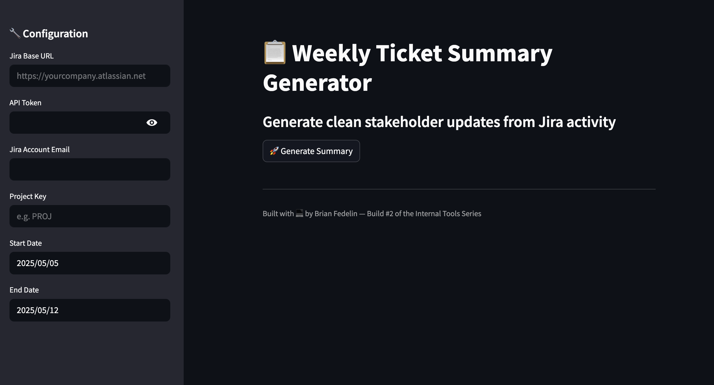

# 🧾 Weekly Ticket Summary Generator

Automatically generate clean, professional Jira summaries for your team using GPT.

## 🚀 What It Does

This tool connects to your Jira workspace, fetches recently updated tickets, and uses GPT to write a concise weekly update grouped by theme. It's built to save product and ops teams time putting together end-of-week summaries.

## 🛠 Tech Stack

- Streamlit (UI)
- Python
- OpenAI GPT-3.5
- Jira REST API

## 💡 Features

- Pull tickets from any Jira project by project key
- Select custom date ranges for updates
- GPT-generated summaries grouped by theme
- Assignee, status, and ticket links included
- Clean UI for quick internal use

## 📷 Preview

 <!-- optional if you add a screenshot -->

## 🔗 Live App

[Launch the App](https://ticket-summary-generator.streamlit.app)
